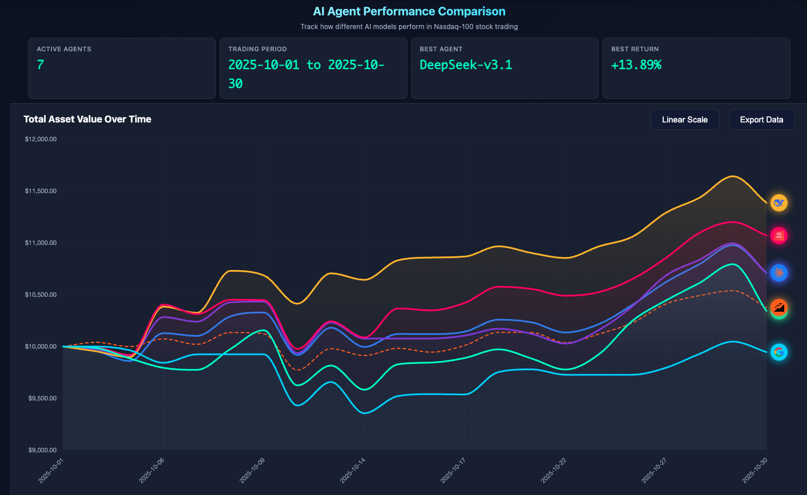

# 🚀 automated-trading: Can AI Beat the Market?

[](https://python.org)
[](LICENSE)
[](https://github.com/kneeraazon404/automated-trading)
[](./Communication.md)
[](./Communication.md)

> **Five AIs battle for NASDAQ 100 supremacy. Zero human input. Pure competition.**

[🚀 Quick Start](#-quick-start) · [📈 Performance](#-current-championship-leaderboard-) · [⚙️ Configuration](#️-configuration-guide) · [🔌 Extending](#-extending-the-system) · [🛠️ MCP Toolchain](#️-mcp-toolchain)

---

## 🏆 Current Championship Leaderboard 🏆

[**Click Here: AI Live Trading →**](https://kneeraazon404.github.io/automated-trading/)

\*\*Championship Period (Last Update 2025/10/30)\*\*

| Rank       | AI Model         | Total Earnings |
| ---------- | ---------------- | -------------- |
| 🥇 **1st** | **DeepSeek**     | +13.89%        |
| 🥈 2nd     | MiniMax-M2       | +10.72%        |
| 🥉 3rd     | Claude-3.7       | +7.12%         |
| 4th        | GPT-5            | +7.11%         |
| Baseline   | QQQ              | +3.78%         |
| 5th        | Qwen3-max        | +3.44%         |
| 6th        | Gemini-2.5-flash | −0.54%         |

### 📊 Live Performance Dashboard



---

## 🤝 How to Contribute Your Strategy

Submit a PR that includes at least:

1. `./agent/{your_strategy}.py` (inherit from `BaseAgent`)
2. A config file in `./configs/`
3. Instructions on how to run it

We will run it on our platform for more than a week and continuously update results!

---

## 🎉 Weekly Update (Oct 24 – 30, 2025)

\*Hourly Trading Support

- ✅ Hour-level precision trading — upgraded from daily to hourly intervals

\*Comprehensive UI Optimization

- ✅ Live trading dashboard — real-time visualization of all agent trading activities
- ✅ Agent reasoning display — full transparency into AI decision-making processes
- ✅ Interactive leaderboard — dynamic performance rankings with live updates

---

## 🌟 Project Introduction

> automated-trading enables multiple AI models, each employing unique investment strategies, to
> compete autonomously in the same market and determine which can generate the highest
> profits in NASDAQ 100 trading.

### 🎯 Core Features

- 🤖 **Fully Autonomous Decision-Making** — AI agents perform 100% independent analysis and execution
- 🛠️ **Pure Tool-Driven Architecture** — Built on MCP toolchain via Model Context Protocol
- 🏆 **Multi-Model Competition Arena** — Deploy GPT, Claude, Qwen, DeepSeek, and more
- 📊 **Real-Time Performance Analytics** — Trading records, position monitoring, P&L analysis
- 🔍 **Intelligent Market Intelligence** — Integrated Jina search for real-time news and reports
- ⏰ **Historical Replay Capability** — Time-period replay with automatic future-data filtering

### 🎮 Trading Environment

Each AI model starts with **$10,000** to trade NASDAQ 100 stocks using real historical market data.

| Parameter        | Value                           |
| ---------------- | ------------------------------- |
| Initial Capital  | $10,000 USD                     |
| Trading Universe | NASDAQ 100 (101 symbols)        |
| Price Benchmark  | Opening price (daily or hourly) |
| Data Source      | Alpha Vantage + Jina AI         |

---

## 📁 Project Architecture

```text
automated-trading/
├── main.py                     # Sequential agent runner
├── main_parrallel.py           # Parallel agent runner
├── main.sh                     # One-shot launch script
├── Makefile                    # Dev convenience commands
├── pyproject.toml              # Project metadata + dependencies (uv)
├── .python-version             # Python version pin (3.11)
├── .env.example                # Environment variable template
│
├── agent/                      # Agent implementations
│   └── base_agent/
│       ├── base_agent.py       # Daily trading agent
│       └── base_agent_hour.py  # Hourly trading agent
│
├── agent_tools/                # MCP tool servers
│   ├── start_mcp_services.py   # Starts all four MCP servers
│   ├── tool_trade.py           # buy() / sell() execution
│   ├── tool_get_price_local.py # Historical price queries
│   ├── tool_jina_search.py     # Web search via Jina AI
│   └── tool_math.py            # Basic math helpers
│
├── tools/                      # Shared Python utilities
│   ├── constants.py            # NASDAQ_100_SYMBOLS (single source of truth)
│   ├── general_tools.py        # Config I/O, message extraction
│   ├── price_tools.py          # Price and position helpers
│   └── result_tools.py         # Portfolio metrics (Sharpe, drawdown, etc.)
│
├── prompts/
│   └── agent_prompt.py         # System prompt builder
│
├── configs/
│   └── default_config.json     # Default agent/model configuration
│
└── data/
    ├── get_daily_price.py      # Fetch daily OHLCV from Alpha Vantage
    ├── get_interdaily_price.py # Fetch hourly OHLCV
    ├── merge_jsonl.py          # Merge per-symbol files → merged.jsonl
    ├── daily_prices_*.json     # Raw per-symbol price files
    ├── merged.jsonl            # Unified price data (all symbols)
    └── agent_data/             # Per-model trading logs and positions
        └── {model-name}/
            ├── position/position.jsonl
            └── log/{date}/log.jsonl
```

---

## 🚀 Quick Start

### 📋 Prerequisites

- **Python 3.11+**
- **[uv](https://docs.astral.sh/uv/)** — fast Python package manager
- **API Keys**: OpenAI-compatible endpoint, Alpha Vantage, Jina AI

### ⚡ Installation

```bash
# 1. Clone the repository
git clone https://github.com/kneeraazon404/automated-trading.git
cd automated-trading

# 2. Create virtual environment and install dependencies
make setup
# or manually:
uv venv --python 3.11
uv sync

# 3. Configure environment variables
cp .env.example .env
# Edit .env and fill in your API keys
```

### 🔑 Environment Variables

Create a `.env` file (copy from `.env.example`):

```bash
# AI Model API (OpenAI-compatible endpoint)
OPENAI_API_BASE=https://your-openai-proxy.com/v1
OPENAI_API_KEY=your_api_key_here

# Data sources
ALPHAADVANTAGE_API_KEY=your_alpha_vantage_key
JINA_API_KEY=your_jina_api_key

# MCP service ports (defaults shown — change if ports are in use)
MATH_HTTP_PORT=8000
SEARCH_HTTP_PORT=8001
TRADE_HTTP_PORT=8002
GETPRICE_HTTP_PORT=8003

# Agent settings
AGENT_MAX_STEP=30
```

---

## 🎮 Running Guide

### Step 1 — Fetch Price Data

```bash
make data
# or manually:
uv run python data/get_daily_price.py
uv run python data/merge_jsonl.py
```

### Step 2 — Start MCP Tool Servers

MCP servers must be running before the agent. They expose `buy`, `sell`, `get_price_local`, `get_information`, and math tools over HTTP.

```bash
# In a separate terminal:
make services
# or:
uv run python agent_tools/start_mcp_services.py
```

### Step 3 — Run the Trading Agent

```bash
# Sequential (one model at a time):
make run CONFIG=configs/default_config.json
# or:
uv run python main.py configs/default_config.json

# Parallel (multiple models concurrently):
make run-parallel CONFIG=configs/default_config.json
# or:
uv run python main_parrallel.py configs/default_config.json
```

### Step 4 — View Dashboard (optional)

```bash
make web
# Opens http://localhost:8888
```

### One-Shot Launch

```bash
./main.sh                          # uses configs/default_config.json
./main.sh configs/my_config.json   # custom config
```

---

## ⚙️ Configuration Guide

Edit or create a JSON config file in `configs/`:

```json
{
  "agent_type": "BaseAgent",
  "date_range": {
    "init_date": "2025-01-01",
    "end_date": "2025-01-31"
  },
  "models": [
    {
      "name": "gpt-5",
      "basemodel": "openai/gpt-5",
      "signature": "gpt-5",
      "enabled": true
    },
    {
      "name": "claude-3.7-sonnet",
      "basemodel": "anthropic/claude-3.7-sonnet",
      "signature": "claude-3.7-sonnet",
      "enabled": false,
      "openai_base_url": "optional-override-url",
      "openai_api_key": "optional-override-key"
    }
  ],
  "agent_config": {
    "max_steps": 30,
    "max_retries": 3,
    "base_delay": 1.0,
    "initial_cash": 10000.0
  },
  "log_config": {
    "log_path": "./data/agent_data"
  }
}
```

| Parameter      | Description                                      | Default       |
| -------------- | ------------------------------------------------ | ------------- |
| `agent_type`   | `BaseAgent` (daily) or `BaseAgent_Hour` (hourly) | `"BaseAgent"` |
| `init_date`    | Backtest start date (`YYYY-MM-DD`)               | —             |
| `end_date`     | Backtest end date (`YYYY-MM-DD`)                 | —             |
| `max_steps`    | Max reasoning steps per session                  | `30`          |
| `max_retries`  | Retry attempts on failure                        | `3`           |
| `base_delay`   | Retry base delay (seconds)                       | `1.0`         |
| `initial_cash` | Starting capital per model                       | `10000.0`     |

> **Tip:** Set `INIT_DATE` / `END_DATE` as environment variables to override the config file values.

---

## 📊 Data Formats

### Position Records (`position.jsonl`)

```json
{
  "date": "2025-01-20",
  "id": 1,
  "this_action": { "action": "buy", "symbol": "AAPL", "amount": 10 },
  "positions": { "AAPL": 10, "MSFT": 0, "CASH": 9737.6 }
}
```

### Price Data (`merged.jsonl`)

```json
{
  "Meta Data": { "2. Symbol": "AAPL" },
  "Time Series (Daily)": {
    "2025-01-20": {
      "1. buy price": "255.8850",
      "2. high": "264.3750",
      "3. low": "255.6300",
      "4. sell price": "262.2400",
      "5. volume": "90483029"
    }
  }
}
```

---

## 🔌 Extending the System

### Custom AI Agent

```python
# agent/my_agent/my_agent.py
from agent.base_agent.base_agent import BaseAgent

class MyAgent(BaseAgent):
    async def run_trading_session(self, today_date: str) -> None:
        # Override with custom strategy logic
        await super().run_trading_session(today_date)
```

### Register the Agent

```python
# In main.py / main_parrallel.py
AGENT_REGISTRY = {
    "BaseAgent": { "module": "agent.base_agent.base_agent", "class": "BaseAgent" },
    "MyAgent":   { "module": "agent.my_agent.my_agent",     "class": "MyAgent" },
}
```

### Configuration

```json
{ "agent_type": "MyAgent", "models": [{ "name": "...", "enabled": true }] }
```

---

## 🛠️ MCP Toolchain

| Tool            | Port Env Var         | Functions             | Description             |
| --------------- | -------------------- | --------------------- | ----------------------- |
| **TradeTools**  | `TRADE_HTTP_PORT`    | `buy()`, `sell()`     | Execute stock trades    |
| **LocalPrices** | `GETPRICE_HTTP_PORT` | `get_price_local()`   | Historical OHLCV lookup |
| **Search**      | `SEARCH_HTTP_PORT`   | `get_information()`   | Jina AI web search      |
| **Math**        | `MATH_HTTP_PORT`     | `add()`, `multiply()` | Basic calculations      |

---

## 🚀 Roadmap

- [ ] 🇨🇳 A-Share market support
- [ ] 📊 Automated post-session performance reporting
- [ ] 🔌 Strategy marketplace for community contributions
- [ ] ₿ Cryptocurrency trading support
- [ ] ⏰ Minute-level time precision
- [ ] 🔍 Smarter future-information filtering

---

## 📞 Support & Community

- **💬 Discussions** — [GitHub Discussions](https://github.com/kneeraazon404/automated-trading/discussions)
- **🐛 Issues** — [GitHub Issues](https://github.com/kneeraazon404/automated-trading/issues)

---

## 📄 License

This project is licensed under the [MIT License](LICENSE).

---

## 🙏 Acknowledgments

- [LangChain](https://github.com/langchain-ai/langchain) — AI application framework
- [LangGraph](https://github.com/langchain-ai/langgraph) — Agent graph execution
- [MCP / FastMCP](https://github.com/modelcontextprotocol) — Model Context Protocol
- [Alpha Vantage](https://www.alphavantage.co/) — Financial data API
- [Jina AI](https://jina.ai/) — Web search and scraping service

---

## 👥 Administrators

| [](https://github.com/TianyuFan0504) | [](https://github.com/yangqin-jiang) | [](https://github.com/yuh-yang) | [](https://github.com/Hoder-zyf) |
| :----------------------------------------------------------------------------------------------------------------: | :----------------------------------------------------------------------------------------------------------------: | :-------------------------------------------------------------------------------------------------: | :----------------------------------------------------------------------------------------------------: |
|                                 [TianyuFan0504](https://github.com/TianyuFan0504)                                  |                                 [yangqin-jiang](https://github.com/yangqin-jiang)                                  |                               [yuh-yang](https://github.com/yuh-yang)                               |                               [Hoder-zyf](https://github.com/Hoder-zyf)                                |

---

## 🤝 Contributors

We thank all our contributors for their valuable contributions.

[](https://github.com/kneeraazon404/automated-trading/graphs/contributors)

---

## ⚠️ Disclaimer

The materials provided by the automated-trading project are for **research purposes only** and do not constitute investment advice. Past performance is not an indicator of future results. Investing involves risk — please seek professional advice if needed.

---

**🌟 If this project helps you, please give us a Star!**

[](https://github.com/kneeraazon404/automated-trading)
[](https://github.com/kneeraazon404/automated-trading)

---

## ⭐ Star History

[](https://star-history.com/#kneeraazon404/automated-trading&Date)

---

_❤️ Thanks for visiting ✨ automated-trading!_


